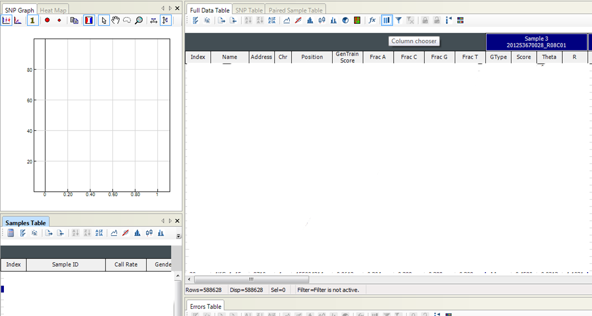
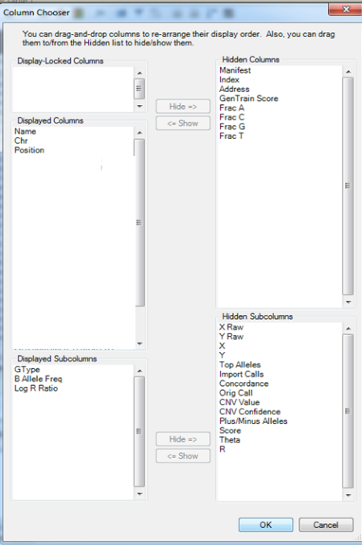

# CNV Calling Pipeline

An integrated pipeline for detecting and analyzing copy number variations (CNVs) from SNP array data using Genome Studio, PennCNV, and custom R analysis tools.

## Overview

Much of this file is adapted from the SOP compiled by Alexandra Evans and combines scripts developed by Ellis Pires.

## Prerequisits

The genome studio part of this requires the windows OS, for linux and mac virtual box is a very good package to use. Details about virtualbox installation can be found here : https://www.virtualbox.org/

## Genome studio

Installation of genome studio is done by following this link:
<https://support.illumina.com/array/array_software/genomestudio/downloads.html>
Choose GenomeStudio v2.0.5 and complete the installation wizard.

Open genome studio in the virtualbox system (or windows if using natively). Genome studio version 2.X or higher (if there is any newer versions...) is required for opening files / projects made in genome studio v2.X. The system is not backwards compatible.

Genome studio recognises .bsc files as Genome studio project files.

The Genome Studio file is not directly compatible with PennCNV and first needs to be converted into a text file containing only the appropriate columns for each sample.  PennCNV requires the LogR Ratio (LRR) and B Allele Frequency (BAF) as measures of the Signal Intensity data to identify CNVs.

### In the Full Data Table, click on the Column Chooser icon (This process will likely be the default for the newest version)



This allows us to choose the columns that are displayed on the Genome Studio file.  PennCNV assumes each sample will contain information in three columns, the genotype, the Log R Ratio and B Allele Frequency.  

In the Displayed Columns menu, highlight and hide the Index, Address, Gen Train Score, and Frac A/C/T/and G columns. Ensure the Displayed columns only show Name, Chr, Position, and the sample locations.
 
Log R Ratio and B Allele Freq will appear in the Hidden Subcolumns window.  Highlight LRR and BAF in this menu and click show to transfer them to the Displayed Subcolumns window.  Ensure the Displayed Subcolumns only shows GType, B Allele Freq and Log R Ratio.

Once this is done, the menu should look like the image below:



Click OK to return to the Genome Studio file, but with different data showing – the Name, Chr and position of each SNP, then the GType, LRR and BAF for each sample.

 The data is then ready for export.  In the Full Data Table, click on the Select All icon at the top left, and this will highlight the entire Full Data Table.  

Then click on the third icon across to Export Displayed Data to a File.  
    
A pop up asks if you wish to export the entire table – click No.
    
When asked to view the new file, again click No.

Virtual box has a shared folder system. Devices > shared folders > shared folders settings. Mount a folder to a directory on the host. Drag files in the guest and the files appear in the host. If you get permission issues save to documents and move the file after export is complete.

## Using Penn CNV

Penn CNV is used to conduct Copy Number Variation (CNV) detection and perform quality control (as well as a few oher functions). A handy wrapper is coded in: ```penncnv-calling.sh```
which is an updated version of the dpmcn-codebank/shared-pipelines/cnv-calling-using-penncnv/ repository in gitlab.

The command to run uses a single argument, the textfile which is output from Genome studio. 

```bash
sbatch penncnv-calling.sh /scratch/<username>/cnv_calling/<Genome_Studio_output>.txt
```

Note it is required that Penn CNV is installed and made available to the system path. Guidance for this is found here: 

https://penncnv.openbioinformatics.org/en/latest/user-guide/install/

This Penn CNV wrapper can be used both locally and via a slurm HPC such as Cardiff HAWK. The script should automatically check for presence of a scratch directory. If this fails the script will make a tmp_scratch directory for intermediate files.